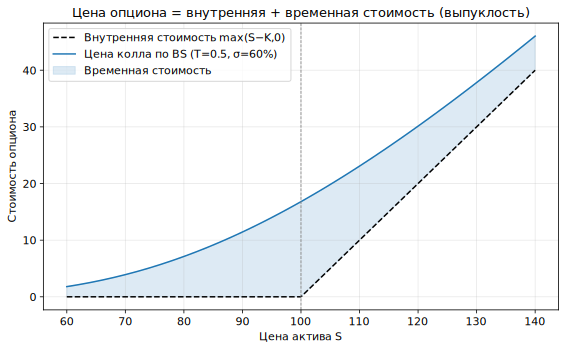
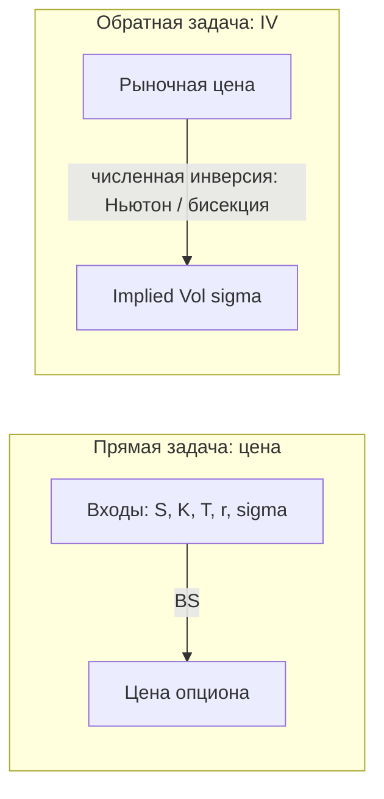
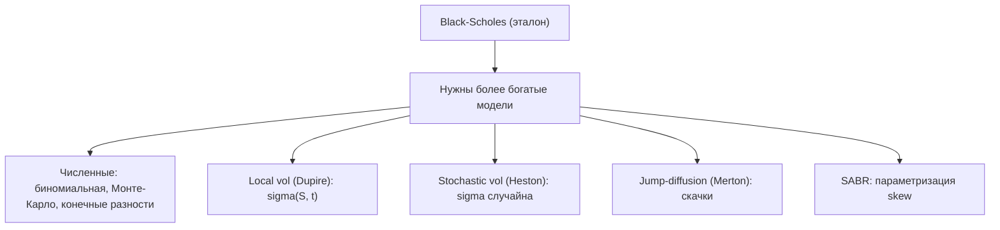

# Урок 2. Модели ценообразования опционов (для крипто-квантов)

> Как из цены опциона рождается implied volatility, откуда берётся Black-Scholes,
> почему её мало и чем её дополняют — с упором на **термины** и на крипто-специфику
> (линейные/обратные инструменты Bybit/Binance, рынок 24/7, funding вместо ставки).

Термины вводятся по ходу жирным с определением. В конце — **Словарь урока**.

---

## 0. Зачем вообще модель

В Уроке 1 мы сказали: модель — это **общий язык**, переводящий цену опциона в
implied volatility и обратно. Здесь разберём этот механизм.

> **Модель ценообразования (pricing model)** — математическая процедура, которая по
> входным параметрам (цена актива, страйк, срок, ставка, волатильность) выдаёт
> справедливую цену опциона при заданных предпосылках о поведении цены актива.

У профи модель нужна **не чтобы найти "истинную" цену** (её задаёт рынок), а чтобы:
- сравнивать опционы разных страйков/сроков в единой шкале (через IV);
- считать греки для хеджа;
- находить отклонения реальных цен от модельных (там живёт edge).

---

## 1. Фундамент: безарбитражность и риск-нейтральная оценка

> **Безарбитражность (no-arbitrage)** — базовый принцип: на «правильно» устроенном
> рынке нельзя получить безрисковую прибыль без вложений. Всё ценообразование
> деривативов выводится из него. Для крипто-кванта это близкая логика: арбитраж
> вычищает несоответствия, и цена дериватива — это цена, при которой арбитража нет.

Отсюда — ключевая идея:

> **Риск-нейтральная оценка (risk-neutral pricing)** — метод, при котором цена опциона =
> **дисконтированное ожидание его выплаты**, посчитанное не в реальных вероятностях, а
> в специальной **риск-нейтральной мере**, где все активы в среднем растут по
> безрисковой ставке.

Формально:

```
Цена = e^(−rT) · E_Q[payoff]
```

- `E_Q[·]` — ожидание в риск-нейтральной мере `Q`;
- `r` — безрисковая ставка (в крипте — см. §6, роль играет carry/funding);
- `T` — срок; `e^(−rT)` — **дисконтирование** (приведение будущих денег к сегодня).

> **Репликация / хедж (replication)** — если выплату опциона можно точно воспроизвести
> непрерывной торговлей базовым активом, то цена опциона не зависит от того, куда актив
> пойдёт в среднем — **только от волатильности**. Это и есть суть Блэка-Шоулза-Мертона:
> опцион = динамически хеджируемый портфель.

**Почему это важно:** отсюда следует, что дельта-хедж (Урок 1) — не «трюк», а
**сама природа** справедливой цены опциона. Продавец, который непрерывно
дельта-хеджирует, в теории реплицирует опцион ровно за его цену.

---

## 2. Put-call parity — самое надёжное соотношение

> **Put-call parity (пут-колл паритет)** — безмодельное соотношение (следует только из
> безарбитражности), жёстко связывающее цены колла и пута одного страйка и срока:

```
C − P = S − K · e^(−rT)
```

- `C`, `P` — цены колла и пута (страйк `K`, срок `T`); `S` — цена актива.

Зачем аналитику:
- **проверка котировок на согласованность** — нарушение паритета = арбитраж или битые данные;
- связывает IV колла и пута одного страйка (в теории равны);
- восстанавливает **forward-цену** и «синтетические» позиции.

> **Forward price (форвардная цена, `F`)** — справедливая цена актива с поставкой в
> будущем: `F = S · e^(rT)` (в крипте `r` заменяется на carry). Опционы «живут» вокруг
> форварда, а не спота — важная поправка для 24/7-рынка с фандингом.

**Крипто-нюанс.** В крипте паритет удобно читать через **перп-базис**:

> **Basis (базис)** — разница между ценой перпа/фьючерса и спота. Через базис и funding
> восстанавливается тот самый `r`/carry, который стоит в паритете. Практически:
> синтетический форвард из перпа должен согласовываться с форвардом, зашитым в опционы —
> иначе арбитраж.

---

## 3. Модель Блэка-Шоулза (Black-Scholes-Merton, BS)

> **Black-Scholes (BS)** — базовая аналитическая формула цены европейского опциона.
> Главный «язык» рынка: через неё считают IV и греки.

> **European / American (европейский / американский опцион)** — **европейский**
> исполняется только в дату экспирации; **американский** — в любой момент до неё. BS
> описывает европейские; крипто-опционы на Bybit/Binance — **европейские** (упрощает жизнь).

### Предпосылки (важно: весь анализ живёт в их нарушении)

1. Цена актива следует **геометрическому броуновскому движению**.
   > **Геометрическое броуновское движение (GBM)** — стандартная модель случайного
   > блуждания цены, при которой доходности нормальны, а сама цена **лог-нормальна**
   > (не бывает отрицательной).
2. **Волатильность постоянна** и известна.
3. Ставка постоянна, торговля непрерывна, без комиссий и ограничений на шорт.
4. Нет выплат по активу (базовая версия; расширяется).
5. Опцион европейский.

Все они в крипте нарушены сильнее, чем в equity (см. §6–7) — и это не баг, а источник работы.

### Формула (call)

```
C = S · N(d1) − K · e^(−rT) · N(d2)

d1 = [ ln(S/K) + (r + σ²/2)·T ] / (σ·√T)
d2 = d1 − σ·√T
```

- `N(·)` — **функция стандартного нормального распределения** (вероятность, что
  нормальная величина ≤ аргумента);
- `σ` — волатильность;
- **`N(d2)`** — риск-нейтральная **вероятность того, что опцион окажется ITM** на экспирации;
- `S·N(d1)` — приведённая стоимость получения актива; `K·e^(−rT)·N(d2)` — приведённая
  стоимость уплаты страйка.

Формулу зубрить не нужно — нужно понимать **смысл частей**.


*Цена опциона по BS лежит выше внутренней стоимости `max(S−K,0)`: разница — временная
стоимость, а изгиб кривой — выпуклость (гамма). К экспирации кривая садится на ломаную payoff.*

### Шесть входов и что наблюдаемо

| Вход | Что это | Наблюдаемо? |
|------|---------|-------------|
| `S` | цена актива | да |
| `K` | страйк | да (параметр контракта) |
| `T` | срок | да |
| `r` | ставка/carry | да (приблизительно) |
| выплаты по активу (стейкинг) | «дивиденд» | да (оценка) |
| **`σ`** | **волатильность** | **НЕТ** |

Пять входов известны, шестой — нет. На этом строится главный трюк.

---

## 4. Ключевой поворот: от цены к implied volatility

Раз цену задаёт рынок, а всё кроме `σ` известно — **разворачиваем формулу и находим σ**,
при которой модельная цена = рыночной.

> **Implied volatility (IV)** (повторим строго) — то значение `σ`, которое, будучи
> подставленным в BS, даёт **ровно рыночную цену** опциона. Это «вменённая» рынком воля.

```
рыночная цена опциона ──(инвертируем BS)──▶ implied volatility (σ_impl)
```

Аналитически σ из BS не выражается → ищут **численно**:

> **Численные методы инверсии** — итеративный подбор σ: **Ньютон-Рафсон** (быстрый,
> использует производную цены по σ = **vega**) или **бисекция** (надёжная, деление
> отрезка пополам). Для крипто-инфры это тот кусок, что реализуют в Rust/Python и гоняют
> на потоке котировок.

Именно поэтому в Уроке 1 IV — центральный объект: **BS используют как конвертер
«цена ↔ IV»**, приводящий все опционы к сопоставимой шкале ожидаемой воли.



---

## 5. Греки как производные модели

> **Греки** — частные производные цены опциона по её входам. То есть они **выводятся из
> модели**, а не задаются отдельно.

- **Delta** = ∂C/∂S — реплицирующая доля актива (сколько спота/перпа держать в хедже).
- **Gamma** = ∂²C/∂S² — кривизна: как быстро меняется дельта.
- **Vega** = ∂C/∂σ — то, чем инвертируют в IV; главный риск воля-трейдера.
- **Theta** = ∂C/∂T — распад во времени.
- **Rho** = ∂C/∂r — к ставке/carry.

> **Дельта-хедж (delta hedge)** — держать `−Δ` актива против опциона, чтобы обнулить
> направленный риск. Остаётся чистая экспозиция на **gamma/vega** — то есть на воля.

> **Gamma-scalping (гамма-скальпинг)** — практика ребалансировки дельта-хеджа: держа
> long gamma, трейдер покупает низко/продаёт высоко при ре-хедже и «собирает» реализованную
> волу. Это операционная форма ставки RV против IV.

---

## 6. Крипто-специфика ценообразования (где наивный перенос из TradFi ломается)

Это ключевой раздел урока. Четыре главных отличия.

### 6.1. Линейные и обратные инструменты — в чём номинирован контракт

> **Linear option (линейный/стейбл-маржинальный опцион)** — опцион, номинированный и
> сеттлящийся **в стейблкоине** (USDT/USDC). Опционы на Bybit и Binance — именно такие:
> и премия, и PnL считаются в стейбле, поведение близко к «учебному» BS.

> **Inverse (обратный/коин-маржинальный) инструмент** — номинирован и сеттлится **в
> базовой монете**, а не в USD. Такими на Bybit/Binance бывают коин-маржинальные перпы и
> фьючерсы, которые часто используются для хеджа опционной позиции. Из-за расчёта в
> монете payoff в долларах **нелинеен**, и греки в USD отличаются от наивных: нужна
> поправка на то, что и цена, и единица измерения — сам BTC.

Практический вывод: **прежде чем считать греки и PnL, следует уточнять, в чём номинирован
инструмент** (стейбл или монета) — линейный и обратный контракты ведут себя по-разному.

### 6.2. Рынок 24/7

> **24/7-конвенция** — крипто-рынок не закрывается. Нет trading-day/overnight-разрывов,
> нет «пропуска выходных». **Annualization** воли и расчёт **theta** идут по
> непрерывному календарному времени (365×24ч), а не по биржевым сессиям, как в equity.

### 6.3. `r` → крипто-carry

> **Carry (керри)** — стоимость удержания/финансирования позиции. В крипте роль
> безрисковой ставки `r` из BS играет комбинация: **funding перпов**, ставки по стейблам
> в лендинге, а «дивидендная доходность» — **staking yield** базового актива. Форвард и
> паритет считаются через этот carry, а не через ставку ЦБ.

### 6.4. Толстые хвосты и джампы — норма, а не экзотика

> **Джамп (jump)** — резкий разрыв цены (листинг/делистинг, каскад ликвидаций, взлом,
> депег стейбла). Предпосылка «непрерывного GBM» в крипте нарушается регулярно.
> **Fat tails (толстые хвосты)** — экстремальные движения случаются чаще, чем
> предсказывает нормальное распределение. Поэтому дальние OTM-опционы «дороже», чем по
> наивному BS, а модели со скачками (§7) актуальны сразу.

---

## 7. Где BS ломается и чем её дополняют

Если бы BS был точен, IV была бы **одинаковой** для всех страйков и сроков. На рынке —
нет, и это порождает **поверхность волатильности** (тема Урока 3):

- **Skew/smile** — IV зависит от страйка (нарушение лог-нормальности/постоянной σ).
- **Term structure** — IV зависит от срока.

Более богатые модели снимают нереалистичные предпосылки:

**Численные методы** (когда нет формулы):
- **Биномиальная модель (Cox-Ross-Rubinstein)** — дерево цен; умеет американские опционы.
- **Монте-Карло** — симуляция траекторий; для сложных/экзотических выплат.
- **Конечные разности** — численное решение уравнения BS (PDE).

**Модели, чинящие «постоянную волатильность»:**
- **Local volatility (Dupire)** — σ как детерминированная функция `(S, t)`; точно
  подгоняется под текущую поверхность.
- **Stochastic volatility (Heston)** — σ **сама случайна**; естественно порождает skew/smile.
- **SABR** — рыночный стандарт интерполяции и управления skew.
- **Jump-diffusion (Merton)** — добавляет **скачки**; объясняет толстые хвосты и дорогие дальние OTM.

> **Калибровка (calibration)** — подбор параметров модели так, чтобы она
> **воспроизводила наблюдаемые рыночные цены** (текущую поверхность). Откалиброванную
> модель затем используют для ценообразования того, что напрямую не торгуется, и для
> согласованного хеджа.

---



## 8. Как это ложится на разделы курса

- **IV** ← инверсия модели (§4).
- **Греки** ← производные модели (§5), основа дельта-хеджа MM.
- **Volatility surface** ← карта отклонений рынка от BS (§7) — **Урок 3**.
- **VRP / vol-arb** ← торговля расхождением модельной и реальной воли (**Урок 4**).
- **Risk** ← сценарии по входам модели (шок `S`, `σ`, джампы, ликвидации) (**Урок 10**).

---

## Главная мысль урока

Модель ценообразования — это **машина перевода «цена ↔ волатильность»** и **генератор
греков**. Black-Scholes даёт язык и эталон; его предпосылки заведомо упрощены, и именно
**систематические отклонения рынка от BS** (skew, term structure, толстые хвосты,
inverse-эффекты) — предмет профессионального анализа, ради которого строят более богатые
модели.

---

## Словарь урока

| Термин | Короткое определение |
|--------|----------------------|
| Модель ценообразования | процедура «входы → справедливая цена опциона» |
| Безарбитражность | нельзя получить безрисковую прибыль без вложений |
| Риск-нейтральная оценка | цена = дисконтированное ожидание payoff в мере Q |
| Дисконтирование | приведение будущих денег к сегодня (`e^(−rT)`) |
| Репликация / хедж | воспроизведение выплаты опциона торговлей активом |
| Put-call parity | `C − P = S − K·e^(−rT)`; безмодельная связь колла и пута |
| Forward price (`F`) | справедливая цена с поставкой в будущем |
| Basis (базис) | разница цены перпа/фьючерса и спота |
| Black-Scholes | базовая формула цены европейского опциона |
| European / American | исполнение только в экспирацию / в любой момент |
| GBM | лог-нормальная модель случайного блуждания цены |
| `N(·)` | функция стандартного нормального распределения |
| `N(d2)` | риск-нейтральная вероятность оказаться ITM |
| Implied volatility (IV) | σ, при которой BS даёт рыночную цену |
| Ньютон-Рафсон / бисекция | численные методы инверсии цены в IV |
| Delta/Gamma/Vega/Theta/Rho | производные цены по входам BS |
| Дельта-хедж | держать −Δ актива, убирая направленный риск |
| Gamma-scalping | ребаланс хеджа, «сбор» реализованной воли |
| Inverse option | опцион с номиналом/сеттлом в базовой монете (нелинеен в USD) |
| Linear option | опцион с номиналом/сеттлом в стейбле |
| 24/7-конвенция | непрерывное время для annualization и theta |
| Carry | стоимость финансирования (funding/стейблы/стейкинг) вместо `r` |
| Jump (джамп) | резкий разрыв цены |
| Fat tails | экстремальные движения чаще, чем у нормального распределения |
| Local / Stochastic vol | σ как функция `(S,t)` / σ как случайный процесс |
| SABR | рыночный стандарт интерполяции skew |
| Jump-diffusion | модель со скачками (толстые хвосты) |
| Калибровка | подгонка параметров модели под рыночную поверхность |

---

## Контрольные вопросы

1. Что такое безарбитражность и как из неё следует риск-нейтральная оценка?
2. Почему справедливая цена опциона не зависит от того, куда актив пойдёт «в среднем»?
   При чём тут репликация и дельта-хедж?
3. Запишите put-call parity. Как в крипте восстановить `r`/carry через перп-базис?
4. Перечислите предпосылки BS. Какие из них в крипте нарушаются сильнее всего и почему?
5. Что означает `N(d2)`? Какой из шести входов BS ненаблюдаем?
6. Опишите процедуру получения IV из рыночной цены. Зачем нужен численный метод и при
   чём тут vega?
7. Чем линейный (стейбл-маржинальный) контракт отличается от обратного (коин-маржинального)
   и почему у обратного греки/PnL в USD считаются иначе?
8. Как в крипте меняются annualization воли и theta из-за режима 24/7?
9. Что заменяет безрисковую ставку `r` в крипте?
10. Чем local volatility отличается от stochastic volatility? Что значит «откалибровать
    модель под поверхность» и зачем?

---

*Предыдущий урок → [Урок 1. Основы анализа опционного рынка](lesson-01-osnovy-analiza-opcionov.md)*
*Следующий урок → [Урок 3. Греки: откуда берутся и зачем нужны](lesson-03-greki.md)*
