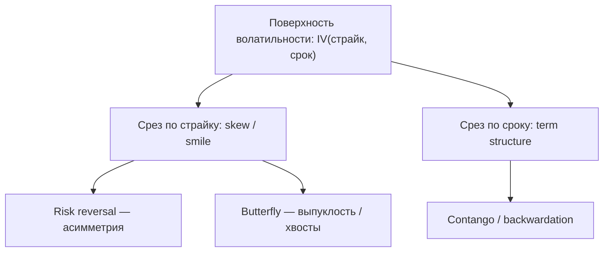

# Урок 4. Поверхность волатильности: skew, smile и term structure

> В Уроке 2 показано, что если бы Black-Scholes был точен, IV была бы **одной и той же**
> для всех страйков и сроков. Рынок говорит обратное. Карта этих различий и есть
> **поверхность волатильности** — центральный объект работы опционного аналитика.

Термины вводятся по ходу жирным с определением. В конце — **Словарь урока**.

---

## 1. От одной IV к поверхности

Из каждой рыночной цены опциона инверсией BS (Урок 2) получается своя implied volatility.
Собрав IV по всем торгуемым контрактам, получаем не одно число, а целую структуру.

> **Поверхность волатильности (volatility surface)** — функция, задающая implied
> volatility для каждой пары (страйк, срок). Три способа на неё смотреть:
> - **срез по страйку** при фиксированном сроке → **skew / smile**;
> - **срез по сроку** при фиксированной «денежности» → **term structure**;
> - обе оси вместе → сама **поверхность**.

Ключевая мысль урока: **форма поверхности — это то, как рынок поправляет наивный BS**,
и именно в этой форме зашита информация о хвостовых рисках, событиях и спросе на
страховку.

---

## 2. Как задают «горизонтальную» ось: денежность и котировка по дельте

Чтобы сравнивать опционы разных страйков и активов, ось страйка нормируют.

> **Денежность (moneyness)** — положение страйка относительно текущей цены/форварда.
> Часто берут **log-moneyness** `ln(K/F)` (F — форвард), чтобы 0 соответствовал ATM, а
> симметричные отклонения читались одинаково для BTC любой цены.

> **ATM-волатильность (at-the-money vol)** — IV опциона со страйком у форварда; «якорь»
> поверхности, общий уровень воли для данного срока.

На практике профи и биржи котируют поверхность **не по страйкам, а по дельте** — так
удобнее, потому что дельта уже нормирует моневость и почти не зависит от цены актива.

> **Котировка по дельте (delta-quoting)** — привязка точки поверхности к дельте опциона,
> а не к абсолютному страйку. Стандартные точки: **ATM (Δ≈0.5)**, **25-дельта** и
> **10-дельта** коллы/путы (умеренные и дальние OTM).

Через дельта-точки задают две главные «ручки формы»:

> **Risk reversal (RR, риск-реверсал)** — разница IV между OTM-коллом и OTM-путом одной
> дельты (напр. `IV(25Δ call) − IV(25Δ put)`). Мера **асимметрии (skew)**: положительный
> RR = коллы дороже путов (спрос на upside), отрицательный = путы дороже (спрос на защиту).

> **Butterfly (BF, «бабочка»)** — насколько крылья (OTM с обеих сторон) дороже центра
> (ATM): `½·[IV(25Δ call) + IV(25Δ put)] − IV(ATM)`. Мера **выпуклости улыбки** — как
> сильно рынок оценивает большие движения в обе стороны (толщину хвостов).

---

## 3. Skew и smile — срез по страйку

> **Smile (улыбка)** — форма, при которой IV **растёт к обоим краям** (и дальние коллы,
> и дальние путы дороже ATM). Симметричная улыбка = рынок дорого оценивает большие
> движения в любую сторону (толстые хвосты, положительный butterfly).

> **Skew (скью, перекос)** — **асимметрия** улыбки: одна сторона систематически дороже
> другой (ненулевой risk reversal).

**Почему это вообще существует** (нарушение предпосылок BS из Урока 2):
- реальные доходности имеют **толстые хвосты и джампы** → дальние OTM «дороже», чем по
  лог-нормальному BS → отсюда улыбка;
- есть **направленный спрос на страховку**: кто-то системно платит за защиту от резких
  движений, поднимая IV на нужной стороне → отсюда перекос.

**Крипто-специфика (важно):**
- В акциях/индексах типичен **put-skew** (путы дороже: страх обвала).
- В крипте перекос **режимо-зависим**: в бычьих фазах часто **call-skew** (RR > 0, спрос
  на upside, «up-crash» тоже возможен), в risk-off — **put-skew** (RR < 0).
- Наблюдение за динамикой RR — быстрый индикатор смены настроения рынка.

---

## 4. Term structure — срез по сроку

> **Term structure of volatility (временная структура волатильности)** — зависимость
> ATM-IV от срока экспирации. Показывает, дороже ли короткая или длинная вола.

> **Contango / backwardation воли** — **contango**: ближние сроки дешевле дальних
> (нормальный спокойный режим, восходящая кривая); **backwardation**: ближние дороже
> дальних (стресс/предстоящее событие, нисходящая кривая).

- Перед известным событием (разлок токенов, халвинг, макро-релиз, листинг) **ближние**
  сроки вздуваются — рынок закладывает разовый скачок именно на эту дату.

> **Forward volatility (форвардная вола)** — вменённая вола на будущий отрезок «между
> двумя сроками», извлечённая из двух точек term structure (аналог форвардной ставки).
> Позволяет спросить «сколько стоит вола за неделю, начинающуюся через месяц» и торговать
> календарные ожидания.

---

## 5. Вся поверхность и её безарбитражность

Поверхность — не произвольный набор чисел: соседние точки связаны условиями отсутствия
арбитража (Урок 2).

> **Butterfly-арбитраж** — нарушение выпуклости по страйку: цены не должны допускать
> бесплатной «бабочки». Ограничивает форму улыбки на данном сроке.

> **Calendar-арбитраж** — нарушение монотонности по сроку: полная (не приведённая)
> дисперсия не должна убывать со временем. Ограничивает term structure.

Чтобы хранить, сглаживать и интерполировать поверхность без арбитража, её
**параметризуют** — описывают несколькими коэффициентами вместо сырых точек.

> **SVI (Stochastic Volatility Inspired)** — популярная параметризация одного среза
> (smile) пятью параметрами; удобна для подгонки и контроля безарбитражности.
> **SABR** — модель (Урок 2), которую широко используют именно как параметризацию skew,
> особенно на рынках ставок/FX; в крипте тоже применяется.

> **Калибровка поверхности** — подбор параметров (SVI/SABR) так, чтобы модельная
> поверхность совпадала с рыночными котировками; результат — гладкая безарбитражная
> поверхность, из которой можно взять IV для любого страйка/срока, включая неторгуемые.

---

## 6. Что аналитик делает с поверхностью

1. **Rich/cheap-анализ.** Сравнить текущую форму с историей/справедливой: где IV, skew
   или butterfly дороги или дёшевы относительно нормы.
2. **Relative value между точками.** Торговать не уровень, а форму:
   > **Risk-reversal-трейд** — ставка на асимметрию (купить одну сторону, продать другую).
   > **Butterfly-трейд** — ставка на выпуклость/толщину хвостов (крылья против центра).
   > **Calendar spread (календарный спред)** — ставка на форму term structure (ближний
   > срок против дальнего).
3. **Извлечение ожиданий.** Из формы поверхности достаётся вменённое распределение цены и
   implied move под событие (тема Урока 6).
4. **Ценообразование и хедж неторгуемого.** Взять IV для любого страйка/срока с
   откалиброванной поверхности; связать движение поверхности с греками:
   > **Sticky strike / sticky delta** — гипотезы о том, как IV конкретного опциона
   > движется при движении спота (остаётся привязанной к страйку или к дельте). От выбора
   > зависит фактическая дельта на скошенной поверхности (связь с **vanna** из Урока 3).

---

## 7. Крипто-специфика поверхности

- **24/7 и форвард.** Срез строится вокруг **форварда**, который в крипте задаётся
  спотом + carry/funding (Уроки 1–2), а не ставкой ЦБ; annualization — по непрерывному
  времени.
- **Ликвидность.** Дальние 10-дельта страйки и длинные сроки на BTC/ETH менее ликвидны,
  чем ATM; котировки там шумные — сглаживание/параметризация особенно важны.
- **Событийные бугры.** Разлоки, апгрейды сети, крупные макро-даты дают характерные
  вздутия ближней term structure — их видно как локальные пики.
- **On-chain vs CEX.** Поверхность on-chain протоколов (AMM-опционы) может расходиться с
  CEX (Bybit/Binance) — источник relative-value и арбитражных наблюдений.
- **Инструменты.** Общий уровень удобно сверять с крипто-VIX-индексом (Урок 1), а форму —
  через RR и BF по 25-дельте.

---

## Главная мысль урока

Одной implied volatility не бывает — есть **поверхность**: IV по всем страйкам и срокам.
Её **срез по страйку** даёт skew/smile (асимметрия и выпуклость, измеряемые risk reversal
и butterfly), **срез по сроку** — term structure (contango/backwardation, событийные
бугры). Форма поверхности — это систематическая поправка рынка к BS, несущая информацию о
хвостах, событиях и спросе на страховку. Аналитик её **параметризует** без арбитража
(SVI/SABR), ищет rich/cheap и торгует **форму** (RR, butterfly, календари), а не только
уровень.

---

## Словарь урока

| Термин | Короткое определение |
|--------|----------------------|
| Поверхность волатильности | IV как функция (страйк, срок) |
| Денежность (moneyness) | положение страйка относительно цены/форварда |
| Log-moneyness | `ln(K/F)`; 0 = ATM |
| ATM-волатильность | IV у форварда; общий уровень воли для срока |
| Котировка по дельте | привязка точки поверхности к дельте, а не к страйку |
| 25-дельта / 10-дельта | стандартные умеренные/дальние OTM-точки |
| Risk reversal (RR) | IV(OTM call) − IV(OTM put); мера skew |
| Butterfly (BF) | крылья минус центр; мера выпуклости улыбки / хвостов |
| Smile (улыбка) | IV растёт к обоим краям (толстые хвосты) |
| Skew (перекос) | асимметрия улыбки; ненулевой RR |
| Put-skew / call-skew | дороже путы / дороже коллы |
| Term structure | зависимость ATM-IV от срока |
| Contango / backwardation | ближние дешевле / дороже дальних |
| Forward volatility | вменённая вола на будущий отрезок между сроками |
| Butterfly-арбитраж | нарушение выпуклости по страйку |
| Calendar-арбитраж | нарушение монотонности дисперсии по сроку |
| SVI | параметризация одного smile пятью параметрами |
| SABR | модель, широко используемая как параметризация skew |
| Калибровка поверхности | подгонка параметров под рыночные котировки без арбитража |
| Calendar spread | трейд формы term structure (ближний срок vs дальний) |
| Sticky strike / sticky delta | гипотезы о движении IV опциона при движении спота |

---

## Контрольные вопросы

1. Что такое поверхность волатильности и какие три «среза» на неё есть?
2. Почему опционы котируют по дельте, а не по абсолютному страйку? Что такое log-moneyness?
3. Дайте определения risk reversal и butterfly. Какую характеристику формы измеряет каждый?
4. Чем smile отличается от skew? Какие нарушения предпосылок BS их порождают?
5. Чем крипто-skew отличается от equity-skew и почему он режимо-зависим?
6. Что такое term structure? Чем contango отличается от backwardation и что означает
   вздутие ближних сроков перед событием?
7. Что такое forward volatility и зачем она нужна?
8. Что ограничивают butterfly- и calendar-арбитраж? Зачем поверхность параметризуют
   (SVI/SABR)?
9. Перечислите способы, которыми аналитик торгует форму поверхности (RR, butterfly,
   календарь). Чем это отличается от торговли уровнем IV?
10. Что такое sticky strike vs sticky delta и как это связано с дельтой и vanna из Урока 3?

---

*Предыдущий урок → [Урок 3. Греки: откуда берутся и зачем нужны](lesson-03-greki.md)*
*Следующий урок → Урок 5. Implied vs realized и volatility risk premium (в планах)*
