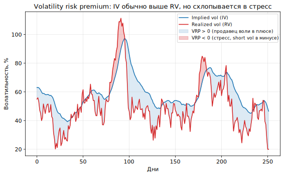
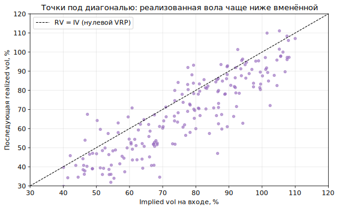

# Урок 5. Implied vs realized и volatility risk premium

> Блок I дал язык (IV, греки, поверхность). Блок II — про то, **на чём зарабатывают**.
> Первый и главный систематический источник дохода в опционах — расхождение между
> **вменённой** и **реализованной** волатильностью. Этот урок разбирает, как измерить RV,
> как её прогнозировать, что такое премия за риск воли и как её собирают на практике.

Термины вводятся по ходу жирным с определением. В конце — **Словарь урока**.

---

## 1. Центральное сравнение

Из Урока 1: **IV** — вменённая рынком вола (из цен опционов), **RV** — фактически
случившаяся. Их разница и есть предмет торговли.

> **Volatility risk premium (VRP)** — систематическое превышение вменённой волатильности
> над последующей реализованной: в среднем `IV > RV`. Экономически это плата за
> страховку: покупатели опционов готовы переплачивать за защиту, продавцы получают
> премию за принятый риск.


*IV почти всё время выше RV (продавец воли собирает премию), но в стрессовые всплески RV
выстреливает выше IV — тогда VRP становится отрицательным, и short vol несёт убыток.*

Задача аналитика: **оценить RV** (что было), **спрогнозировать RV** (что будет), сравнить
с **IV** (что заложено) и понять, дорога вола или дёшева.

---

## 2. Как измерить realized volatility

> **Realized volatility (RV)** — оценка фактической волатильности актива за период по его
> ценам. Обычно приводится к году (**annualized**).

### 2.1. Close-to-close (базовый способ)

> **Close-to-close** — стандартное отклонение логарифмических доходностей по ценам
> закрытия: `r_t = ln(P_t / P_{t−1})`, затем `RV = std(r) · √(периодов в году)`.

- Простой и несмещённый, но **шумный**: использует только цену закрытия, игнорируя весь
  путь внутри периода.

> **Логарифмическая доходность (log-return)** — `ln(P_t/P_{t−1})`; аддитивна во времени,
> поэтому удобна для оценки волатильности.

### 2.2. Оценки по диапазону (эффективнее)

Используют не только close, но и **OHLC** (open-high-low-close) — за счёт этого точнее при
том же числе наблюдений.

> **Parkinson** — оценка по дневному диапазону high-low. Точнее close-to-close, но не
> учитывает гэпы открытия и снос (drift).
> **Garman-Klass** — использует OHLC целиком; ещё эффективнее Parkinson.
> **Rogers-Satchell** — корректно работает при ненулевом сносе (тренде).
> **Yang-Zhang** — комбинирует overnight-гэп, open-close и Rogers-Satchell; наиболее
> эффективная из распространённых, устойчива к гэпам и сносу.

> **Эффективность оценки** — сколько «шума» в оценке при данном числе наблюдений. Range-
> оценки дают ту же точность на меньшем окне → быстрее реагируют, меньше запаздывают.

**Крипто-специфика:**
- Рынок **24/7** — почти нет overnight-гэпов (компонента Yang-Zhang для гэпа мала), зато
  важен **выбор частоты** отсчётов (5-минутки, часы, дни).
- **Каскады ликвидаций** дают резкие внутрисвечные проколы — range-оценки их видят лучше,
  чем close-to-close.

---

## 3. Как спрогнозировать realized volatility

Сравнивать IV нужно с **будущей** RV, а её приходится прогнозировать. Это возможно, потому
что вола обладает памятью.

> **Volatility clustering (кластеризация волатильности)** — свойство рынков: спокойные
> периоды сменяются спокойными, бурные — бурными. Высокая вола сегодня повышает шанс
> высокой воли завтра. Формально это эффект **ARCH**.

Основные модели прогноза:

> **EWMA (экспоненциально взвешенное среднее, RiskMetrics)** — оценка дисперсии с
> экспоненциально затухающими весами прошлых доходностей: свежие важнее. Один параметр
> (λ), просто и на удивление рабоче.

> **GARCH** — модель, где сегодняшняя дисперсия зависит от вчерашнего шока и вчерашней
> дисперсии; захватывает кластеризацию и **возврат к среднему** уровню воли. Классический
> инструмент прогноза RV.

> **HAR-RV (Heterogeneous AutoRegressive)** — прогноз реализованной воли по её же
> значениям на разных горизонтах (дневном, недельном, месячном). Прост и силён на
> высокочастотных данных; популярен в проде.

Цель всех трёх — число «ожидаемая RV на горизонт опциона», которое ставят против IV.

---

## 4. Volatility risk premium как источник дохода

### 4.1. Почему премия положительна

- **Спрос на страховку:** участники системно покупают защиту (путы, крылья) и готовы
  переплачивать → IV выше справедливой.
- **Неприятие риска и хвосты:** продавец берёт на себя редкий большой убыток и требует за
  это премию (**jump/tail premium**).
- Эмпирически `IV > RV` в среднем на большинстве рынков и таймфреймов.


*Каждая точка — момент входа: вменённая вола против случившейся после. Облако смещено под
диагональ `RV=IV` — в среднем реализованная вола ниже вменённой, это и есть премия.*

### 4.2. Как её собирают

> **Short volatility (продажа воли)** — систематическая продажа опционов/стрэддлов с
> дельта-хеджем, чтобы инкассировать VRP. Формы: продажа straddle/strangle, covered call,
> продажа вариансы, option vaults (Ribbon-подобные протоколы в крипте).

> **Variance risk premium** — тот же эффект, выраженный через дисперсию (квадрат воли);
> вариансные свопы позволяют торговать его напрямую, без дельта-хеджа опционов.

### 4.3. Когда премия схлопывается (риск стратегии)

VRP — не «бесплатные деньги». Он **отрицателен именно тогда, когда больно**:
- в резком движении RV выстреливает выше IV → продавец воли (short gamma) несёт большой
  убыток (см. первый график и Урок 3);
- профиль дохода short vol: **много мелких плюсов и редкие крупные минусы** (короткий хвост
  прибыли, длинный хвост убытка).
- Поэтому сбор VRP требует лимитов, хвостового хеджа и понимания, что стратегия
  «продаёт страховку», а страховщик разоряется в катастрофу.

---

## 5. Дельта-хедж на практике (продолжение Урока 3)

VRP собирают не «голой» продажей опциона, а **дельта-хеджированной** позицией — чтобы
изолировать воля-компоненту от направления.

### 5.1. Фундаментальный результат

PnL непрерывно дельта-хеджированного опциона за период равен (гамма-взвешенно) разнице
**реализованной и вменённой дисперсии**:

```
PnL(hedged) ≈ ½ · Σ Γ_t · S_t² · ( реализованная − вменённая дисперсия )
```

То есть длинная дельта-хеджированная позиция зарабатывает, если фактические движения
превзошли заложенную в IV волу — ровно ставка **RV vs IV** на уровне механики (Урок 3).

### 5.2. Реальные трения

> **Ошибка дискретного хеджа (discrete hedging error)** — на практике хеджируют не
> непрерывно, а по шагам (по времени или по порогу дельты). Реже хедж → больше разброс
> PnL; чаще → выше транзакционные косты. Между этим ищут баланс.

> **Gamma-scalping** — операционная форма long-gamma-ставки: при ре-хедже долгой позиции
> актив покупается на просадках и продаётся на росте, «собирая» реализованную волу. В
> плюсе, если RV > IV сверх косто́в хеджа.

- **Косты в крипте:** комиссии, спред/проскальзывание, **funding** по перпу, которым
  хеджируют дельту. В тонком стакане дальних страйков ре-хедж дорог.

---

## 6. Крипто-специфика

- **Funding как родственный carry.** Перп-фандинг — отдельная премия за риск, часто
  коррелирует с VRP; иногда её собирают вместе (продажа воли + учёт стоимости хеджа
  фандингом).
- **Толстый хвост RV.** Ликвидации и депеги дают экстремальные всплески реализованной
  воли → short vol в крипте опаснее, чем в equity; хвостовой хедж критичен.
- **Vaults и краудинг.** DeFi option vaults систематически продают воля-премию; при
  переполнении такой стратегии её доходность падает, а риск в стресс растёт.
- **Данные 24/7.** RV удобно считать на высокой частоте (HAR-RV), но нужно чистить
  биржевые аномалии и учитывать разную ликвидность площадок.

---

## Главная мысль урока

Главный систематический edge в опционах — **VRP**, то есть в среднем `IV > RV`. Чтобы им
пользоваться, RV **измеряют** (эффективнее — range-оценки: Parkinson, Garman-Klass,
Yang-Zhang), **прогнозируют** (EWMA, GARCH, HAR-RV) и сравнивают с IV. Собирают премию
**дельта-хеджированной продажей воли**, чьё PnL по сути равно `реализованная − вменённая`
дисперсия. Но VRP — это плата за страховку: он отрицателен именно в кризис, поэтому short
vol требует управления хвостовым риском, а в крипте — особенно (ликвидации, депеги, фандинг).

---

## Словарь урока

| Термин | Короткое определение |
|--------|----------------------|
| Volatility risk premium (VRP) | систематическое превышение IV над последующей RV |
| Realized volatility (RV) | оценка фактической воли по ценам актива |
| Annualized | приведение воли к годовому масштабу |
| Log-return | `ln(P_t/P_{t−1})`; логарифмическая доходность |
| Close-to-close | оценка RV по стандартному отклонению доходностей закрытия |
| Parkinson | range-оценка RV по high-low |
| Garman-Klass | range-оценка по всему OHLC |
| Rogers-Satchell | range-оценка, корректная при сносе |
| Yang-Zhang | наиболее эффективная range-оценка (гэп + open-close + RS) |
| Эффективность оценки | точность при данном числе наблюдений |
| Volatility clustering | кластеризация воли; эффект ARCH |
| EWMA | экспоненциально взвешенная оценка дисперсии (RiskMetrics) |
| GARCH | модель дисперсии с кластеризацией и возвратом к среднему |
| HAR-RV | прогноз RV по горизонтам день/неделя/месяц |
| Short volatility | систематическая продажа воли с дельта-хеджем ради VRP |
| Variance risk premium | VRP, выраженный через дисперсию (вариансные свопы) |
| Jump / tail premium | часть премии за редкий большой убыток |
| Discrete hedging error | разброс PnL из-за неполного (шагового) хеджа |
| Gamma-scalping | сбор реализованной воли при ре-хедже long gamma |

---

## Контрольные вопросы

1. Что такое VRP и почему в среднем `IV > RV`? Приведите экономическое объяснение.
2. Как устроена close-to-close оценка RV и в чём её главный недостаток?
3. Чем range-оценки (Parkinson, Garman-Klass, Yang-Zhang) лучше close-to-close? Что
   особенного в Yang-Zhang?
4. Почему в крипте overnight-компонента мала, но важен выбор частоты отсчётов?
5. Что такое volatility clustering и почему благодаря ему RV вообще прогнозируема?
6. Сравните EWMA, GARCH и HAR-RV: что каждая модель прогнозирует и за счёт чего?
7. Как собирают VRP на практике? Чем variance risk premium отличается от обычной продажи
   опционов?
8. Почему VRP называют «платой за страховку» и когда он становится отрицательным?
9. Запишите смысл PnL дельта-хеджированного опциона через реализованную и вменённую
   дисперсию. Как это связано с gamma-scalping?
10. Что такое ошибка дискретного хеджа и какой компромисс возникает при выборе частоты
    ре-хеджа? Какие косты особенно важны в крипте?

---

*Предыдущий урок → [Урок 4. Поверхность волатильности](lesson-04-poverhnost-volatilnosti.md)*
*Следующий урок → [Урок 6. Перпы, фьючерсы и базис: carry и хеджинг-слой](lesson-06-perpy-fyuchersy-bazis.md)*
