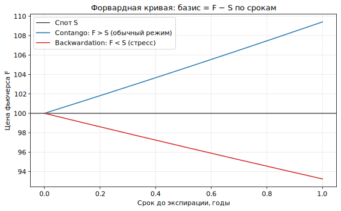
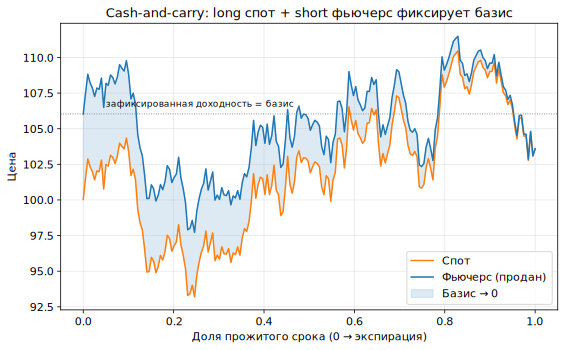

# Урок 6. Перпы, фьючерсы и базис: carry и хеджинг-слой

> Опционы не существуют в вакууме: дельту хеджируют перпом или фьючерсом, а `r`/форвард
> из Уроков 2 и 5 задаётся **carry**. Этот урок формализует деривативную связку
> **спот ↔ перп ↔ фьючерс ↔ опцион** — тот слой, на который опирается весь хедж и
> кросс-инструментальные стратегии.

Аудитория механику перпов знает, поэтому фокус не на «что такое фьючерс», а на **связках,
базисе и carry**, которые соединяют перпы с опционами. Термины — жирным с определением,
в конце **Словарь урока**.

---

## 1. Три инструмента и что их связывает

> **Спот (spot)** — покупка/продажа самого актива с немедленной поставкой; базовая точка отсчёта.

> **Фьючерс с фиксированной экспирацией (dated future)** — обязательство обменять актив по
> цене `F` в дату `T`. Ключевое свойство: к экспирации `F` **сходится к споту** (иначе
> арбитраж). В крипте это обычно **квартальные** контракты.

> **Перпетуал (perpetual, перп)** — фьючерс **без даты экспирации**. Чтобы он не «уплывал»
> от спота, введён механизм фандинга.

> **Funding rate (фандинг)** — периодический платёж между лонгами и шортами перпа. Когда
> перп торгуется выше спота (лонгов больше), лонги платят шортам → это давит цену перпа к
> споту; и наоборот. Фандинг — рыночная цена «удержания» плеча и, как увидим, **аналог
> carry/ставки** из формул ценообразования.

Связь всех трёх — через **базис**.

---

## 2. Базис и форвардная кривая

> **Базис (basis)** — разница между ценой фьючерса (или перпа) и спотом: `basis = F − S`.
> Часто выражают в годовых процентах (**annualized basis**), чтобы сравнивать разные сроки.

> **Cost-of-carry (стоимость удержания)** — модель форварда: `F = S · e^{(r − y)·T}`, где
> `r` — стоимость финансирования, `y` — доходность владения активом. В крипте `r` ≈
> ставка по стейблам/фандинг, `y` ≈ **staking yield**. То есть базис — это материализованный
> carry.


*Форвардная кривая: в contango фьючерс дороже спота (положительный carry), в backwardation —
дешевле (дефицит предложения/стресс). Наклон = базис по сроку.*

> **Contango / backwardation базиса** — **contango**: `F > S`, кривая растёт (обычный
> режим бычьего рынка/положительного фандинга); **backwardation**: `F < S`, кривая падает
> (стресс, спрос на немедленный актив, отрицательный фандинг).

**Связь с опционами.** Тот же carry входит в put-call parity (Урок 2) и задаёт форвард,
вокруг которого строится **вся поверхность волатильности** (Урок 4). Базисная кривая
фьючерсов и «форвард, зашитый в опционы», должны согласовываться — иначе арбитраж.

---

## 3. Форвард из опционов: связка замыкается

Из put-call parity (Урок 2) форвард можно собрать **синтетически** из опционов:

```
F = K + e^{rT} · (C − P)      (для страйка K, одного срока)
```

> **Синтетический форвард (synthetic forward)** — позиция «длинный колл + короткий пут»
> одного страйка и срока, повторяющая фьючерс. Даёт форвард-цену, **вменённую опционами**.

Получается «треугольник согласованности» без арбитража:

- **спот + carry** → форвард,
- **фьючерс/перп** → форвард напрямую,
- **опционы (put-call parity)** → синтетический форвард.

Все три должны давать одну форвард-цену. Расхождения — сигнал арбитража или разной
стоимости финансирования на площадках.

---

## 4. Cash-and-carry и базисный арбитраж

Раз базис к экспирации сходится к нулю, его можно **зафиксировать**.

> **Cash-and-carry** — одновременно купить спот и продать фьючерс при `F > S` (contango).
> К экспирации базис исчезает, и позиция приносит **зафиксированную доходность = начальный
> базис**, независимо от того, куда пошла цена (направление захеджировано).


*Long спот + short фьючерс: цена гуляет как угодно, но базис линейно сходится к нулю, и
итоговая доходность равна начальному базису — чистый carry без направленного риска.*

> **Reverse cash-and-carry** — обратная сделка при backwardation (`F < S`): продать спот
> (или занять актив), купить фьючерс.

> **Funding-basis carry** — крипто-версия на перпах: держать спот против короткого перпа и
> **инкассировать положительный фандинг** (или ловить расхождение перп-базиса против
> квартального фьючерса). По сути тот же carry, но платится фандингом, а не сходимостью к дате.

**Риски (это не безрисковый доход):**
- **фандинг плавает** — положительный carry может стать отрицательным;
- **маржа и ликвидации** — короткий перп/фьючерс требует маржи; резкий рост цены → margin
  call по шорту, даже если спот покрывает;
- **биржевой/контрагентский риск**, стоимость и лимиты вывода, риск стейбла.

---

## 5. Дельта-хедж опционов перпом или фьючерсом

Здесь связка смыкается с Уроками 3 и 5: **дельту опционной позиции гасят перпом/фьючерсом**.

- **Перп удобнее** для непрерывного хеджа: нет экспирации, не нужно перекатывать контракт.
  Цена этого удобства — **фандинг** (он и есть стоимость удержания хеджа, тот самый carry).
- **Квартальный фьючерс** — фиксированный базис, но требует ролловера у экспирации.

> **Ролловер (roll)** — перенос позиции из истекающего контракта в следующий; несёт
> стоимость, зависящую от базиса между сроками.

**Поправка на тип контракта (из Урока 2).** Если хедж делается **инвертированным
(коин-маржинальным)** перпом, размер хеджа считается с поправкой на номинал в монете:
USD-дельту опциона нельзя гасить «в лоб» номиналом коин-маржинального контракта. С
**линейными** (стейбл-маржинальными) перпами Bybit/Binance сайзинг ближе к прямому.

Итог: стоимость сбора VRP (Урок 5) включает **funding-косты хеджа** — иногда именно они
определяют, останется ли дельта-хеджированная продажа воли в плюсе.

---

## 6. Крипто-специфика

- **Фандинг как торгуемый carry.** В крипте carry не абстрактная ставка, а живой,
  наблюдаемый и **волатильный** фандинг; он сам становится предметом стратегий.
- **Взрывы базиса.** В эйфории базис/фандинг взлетают (перегрев плеча), в кризис уходят в
  глубокую backwardation — и то и другое ломает наивные carry-стратегии.
- **Коин- vs стейбл-маржа.** Тип маржи влияет и на PnL хеджа, и на риск ликвидации
  (коин-маржа: залог дешевеет одновременно с ростом убытка по шорту).
- **Согласованность площадок.** Перп-базис на Bybit/Binance, квартальные фьючерсы и
  форвард из опционов могут расходиться — источник relative-value и арбитражных наблюдений.

---

## Главная мысль урока

Перпы и фьючерсы в этом курсе — **хеджинг- и carry-слой** под опционами, а связывает их
**базис**. Базис = материализованный carry (`F = S·e^{(r−y)T}`), в крипте выражаемый через
**фандинг** и staking-доходность. Форвард, полученный из спота+carry, из фьючерса и из
опционов (put-call parity), должен совпадать — это «треугольник без арбитража». Сходимость
базиса даёт **cash-and-carry** и **funding-basis carry**, а дельту опционов гасят перпом,
чья стоимость удержания — тот же фандинг. Поэтому корректный учёт базиса и фандинга —
обязательная часть и ценообразования (Урок 2), и сбора VRP (Урок 5).

---

## Словарь урока

| Термин | Короткое определение |
|--------|----------------------|
| Спот | актив с немедленной поставкой; точка отсчёта |
| Dated future | фьючерс с датой; F сходится к споту на экспирации |
| Перпетуал | фьючерс без экспирации, удерживаемый у спота фандингом |
| Funding rate | платёж лонг↔шорт в перпе; аналог carry/ставки |
| Базис (basis) | `F − S`; часто в годовых % |
| Cost-of-carry | `F = S·e^{(r−y)T}`; базис как carry |
| Contango / backwardation | `F > S` (растёт) / `F < S` (падает) |
| Синтетический форвард | long call + short put; форвард из опционов |
| Треугольник без арбитража | согласованность форварда: спот+carry / фьючерс / опционы |
| Cash-and-carry | long спот + short фьючерс; фиксирует базис |
| Reverse cash-and-carry | обратная сделка при backwardation |
| Funding-basis carry | сбор фандинга: спот против короткого перпа |
| Ролловер (roll) | перенос позиции в следующий контракт |
| Коин- / стейбл-маржа | залог в монете / в стейбле; влияет на хедж и ликвидации |

---

## Контрольные вопросы

1. Чем перп отличается от квартального фьючерса и что удерживает перп у цены спота?
2. Дайте определение базиса. Как он связан с cost-of-carry и что играет роль `r` и `y` в крипте?
3. Что такое contango и backwardation базиса и какие рыночные режимы им соответствуют?
4. Как собрать синтетический форвард из опционов? Что такое «треугольник без арбитража»?
5. Опишите механику cash-and-carry. Почему её доходность равна начальному базису и не
   зависит от направления цены?
6. Что такое funding-basis carry на перпах и какие у него риски (фандинг, маржа, ликвидации)?
7. Почему перп удобнее фьючерса для непрерывного дельта-хеджа и в чём цена этого удобства?
8. Как тип контракта (коин- vs стейбл-маржа) влияет на размер дельта-хеджа и на риск ликвидации?
9. Почему funding-косты хеджа входят в экономику сбора VRP (связь с Уроком 5)?
10. Как базис/форвард из фьючерсов связан с форвардом, зашитым в поверхность волатильности
    (связь с Уроками 2 и 4)?

---

*Предыдущий урок → [Урок 5. Implied vs realized и volatility risk premium](lesson-05-iv-vs-rv-vrp.md)*
*Следующий урок → [Урок 7. Вменённые вероятности (risk-neutral density)](lesson-07-vmenennye-veroyatnosti.md)*
