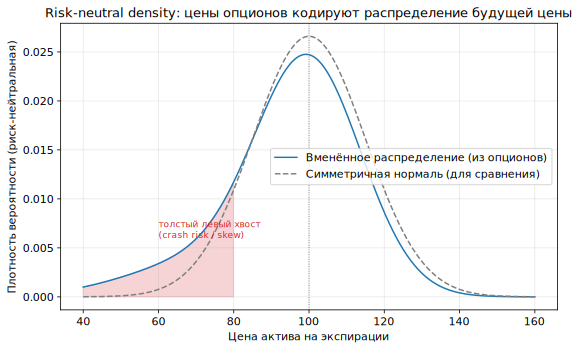
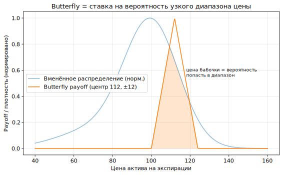

# Урок 7. Вменённые вероятности (risk-neutral density) — мост к рынку предсказаний

> Кульминация Блока II. Цены опционов кодируют не одно число, а **целое распределение
> вероятностей** будущей цены. Этот урок показывает, как его извлечь, как читать butterfly
> и straddle как «цены вероятностей», и почему это прямой мост к **рынку предсказаний**.

Термины — жирным с определением, в конце **Словарь урока**.

---

## 1. Опцион как ставка на вероятность

Из Урока 2: в формуле Блэка-Шоулза `N(d2)` — это **риск-нейтральная вероятность** того,
что опцион окажется ITM. Значит цена опциона уже несёт вероятностную информацию. Доведём
идею до предела через простейший инструмент.

> **Бинарный (digital) опцион** — платит фиксированную сумму (напр. 1), если условие
> выполнено (цена выше страйка), и 0 иначе. Его справедливая цена ≈ **риск-нейтральная
> вероятность** этого события (дисконтированная).

Бинарный опцион — это буквально «контракт на вероятность»: цена 0.30 ≈ рынок оценивает
шанс события в ~30%. Это тот же объект, что торгуется на **рынке предсказаний** (там цена
контракта «да» и есть вменённая вероятность исхода). Дальше покажем, что из обычных
опционов извлекается **вся** кривая таких вероятностей.

---

## 2. Risk-neutral density: распределение из цен опционов

> **Risk-neutral density (RND, риск-нейтральная плотность)** — вменённое рынком
> распределение вероятностей цены актива на дату экспирации, извлечённое из цен опционов
> всех страйков одного срока.

*Набор цен опционов по страйкам восстанавливает целое распределение будущей цены. У
крипты/акций оно обычно с толстым левым хвостом (crash risk) — это и есть skew из Урока 4,
переведённый в вероятности.*

Ключевой инструмент извлечения:

> **Формула Бридена-Литценбергера (Breeden-Litzenberger)** — риск-нейтральная плотность
> равна **второй производной цены колла по страйку**: `RND(K) = e^{rT} · ∂²C/∂K²`. То
> есть распределение «спрятано» в кривизне цен опционов по страйку.

На практике вторую производную приближают **баттерфляем** (конечные разности по трём
соседним страйкам) — поэтому butterfly и есть «измеритель плотности».

---

## 3. Butterfly и straddle как цены вероятностей

> **Butterfly (бабочка)** как вероятность: комбинация «+1 колл(K−ΔK), −2 колл(K),
> +1 колл(K+ΔK)» даёт треугольный payoff вокруг `K`. Её цена ≈ **вероятность того, что
> цена окажется в узком диапазоне** около `K` (площадь RND на этом интервале).

*Треугольный payoff бабочки «вырезает» узкий диапазон: её цена пропорциональна вероятности
попасть в этот диапазон — точечная оценка плотности из §2.*

> **Implied move / expected move (вменённое движение)** — ожидаемая рынком амплитуда
> движения к сроку. Быстрая оценка: `≈ цена ATM-straddle` (колл+пут у денег) или
> `≈ S · σ_ATM · √T`. Отвечает на вопрос «какой диапазон рынок закладывает под событие».

Итог: разные опционные конструкции читаются как **вопросы к распределению**:
- бинарный/вертикальный спред → вероятность «выше/ниже уровня»;
- butterfly → вероятность «в диапазоне»;
- straddle → ожидаемая амплитуда (implied move).

---

## 4. Важнейшая оговорка: риск-нейтральные ≠ реальные вероятности

> **Risk-neutral vs physical (real-world) probability** — RND искажена **премией за риск**:
> вероятности «плохих» исходов в ней **завышены** относительно реальных, потому что рынок
> доплачивает за страховку (это тот же VRP и skew из Уроков 4–5). Поэтому RND нельзя читать
> как настоящий прогноз вероятностей.

- Пример: вменённая вероятность обвала обычно **выше** исторической частоты обвалов —
  разница и есть цена страховки.
- Чтобы перейти к «реальному» распределению, применяют **репрайсинг меры** (оценивают
  risk premium) — но это отдельная, шумная задача.

Практический вывод: RND — это **цены вероятностей**, по которым можно торговать и хеджировать,
но не беспристрастный форкаст. Ровно та же осторожность нужна и на рынке предсказаний.

---

## 5. Мост к рынку предсказаний

Теперь связь становится прямой.

- **Цена контракта = вменённая вероятность.** На prediction-маркете цена исхода «да» ∈ [0,1]
  — это в точности бинарный опцион на событие. Вся математика §1–3 переносится один к одному.
- **Безарбитражность по взаимоисключающим исходам.** Как цены опционов не должны допускать
  butterfly/calendar-арбитраж (Урок 4), так и цены исходов события должны **суммироваться к 1**
  (с поправкой на комиссию/спред). Нарушение = арбитраж — знакомый крипто-паттерн.
- **«Поверхность» вероятностей.** По аналогии с поверхностью волатильности строится
  структура вменённых вероятностей по уровням/датам; её так же калибруют, ищут rich/cheap и
  относительную стоимость между связанными рынками.
- **Risk/behavioral premium.** Как RND искажена премией за риск, так и prediction-маркеты
  смещены (фаворит-лонгшот, ликвидность, комиссии) — цена ≠ честная вероятность.

Практически: аналитику рынка предсказаний нужны те же кирпичи, что и опционному, —
извлечение вменённых вероятностей, контроль безарбитражности, отделение премии от прогноза,
инфраструктура данных и бэктеста (Блок III).

---

## 6. Крипто-специфика

- **Извлечение RND из опционной цепочки BTC/ETH** (Bybit/Binance) — стандартная процедура:
  берётся срез по страйкам, применяется Breeden-Litzenberger, сглаживается через
  параметризацию поверхности (Урок 4), чтобы плотность была гладкой и неотрицательной.
- **Событийный implied move** — под разлоки токенов, апгрейды сети, макро-даты straddle даёт
  ожидаемую амплитуду; полезно и для тайминга, и для оценки «дорого/дёшево» события.
- **On-chain prediction-маркеты** (напр. Polymarket) — прямой источник вменённых вероятностей;
  их можно сопоставлять с RND из опционов на коррелированные активы (например, вероятность
  ценового уровня BTC).

---

## Главная мысль урока

Цены опционов одного срока кодируют **целое распределение** будущей цены — risk-neutral
density, извлекаемую по **Бридену-Литценбергеру** как вторую производную цены по страйку
(на практике — через butterfly). Опционные конструкции читаются как цены вероятностей:
вертикаль — «выше/ниже», butterfly — «в диапазоне», straddle — implied move. Но RND искажена
премией за риск и **не равна** реальным вероятностям. Всё это переносится на **рынок
предсказаний**, где цена исхода и есть вменённая вероятность, с той же безарбитражностью
(сумма исходов = 1) и той же оговоркой про премию — что и делает опционный инструментарий
прямым мостом к аналитике prediction-маркетов.

---

## Словарь урока

| Термин | Короткое определение |
|--------|----------------------|
| Бинарный (digital) опцион | платит 1, если событие; цена ≈ риск-нейтральная вероятность |
| Risk-neutral density (RND) | вменённое распределение цены на экспирации из опционов |
| Breeden-Litzenberger | `RND(K) = e^{rT}·∂²C/∂K²`; плотность из кривизны цен по страйку |
| Butterfly как вероятность | цена бабочки ≈ вероятность узкого диапазона цены |
| Implied / expected move | ожидаемая амплитуда движения (≈ ATM-straddle или `S·σ·√T`) |
| Вертикальный спред | ставка на вероятность «выше/ниже уровня» |
| Risk-neutral vs physical | вменённые вероятности искажены премией за риск ≠ реальные |
| Репрайсинг меры | переход от RN к реальному распределению через оценку risk premium |
| Сумма исходов = 1 | условие безарбитражности взаимоисключающих событий |
| Prediction-маркет | рынок, где цена исхода = вменённая вероятность (бинарный опцион) |

---

## Контрольные вопросы

1. Почему цену бинарного опциона можно читать как вероятность? Что означает `N(d2)`?
2. Что такое risk-neutral density и какую информацию она несёт по сравнению с одной IV?
3. Сформулируйте Бридена-Литценбергера. Почему butterfly приближает плотность?
4. Как из опционов оценить вероятность «цена в диапазоне» и ожидаемую амплитуду движения
   (implied move)?
5. Чем риск-нейтральные вероятности отличаются от реальных и почему их нельзя читать как
   честный прогноз?
6. Как связаны skew/толстый левый хвост из Урока 4 с формой RND?
7. Почему цена контракта на prediction-маркете — это бинарный опцион на событие?
8. Какое условие безарбитражности связывает цены взаимоисключающих исходов и на какое
   опционное условие оно похоже?
9. Какие искажения (помимо математики) есть у цен на рынке предсказаний, по аналогии с
   премией за риск в RND?
10. Опишите процедуру извлечения RND из опционной цепочки BTC/ETH и зачем нужна
    параметризация поверхности при этом.

---

*Предыдущий урок → [Урок 6. Перпы, фьючерсы и базис](lesson-06-perpy-fyuchersy-bazis.md)*
*Следующий урок → Урок 8. Данные и инфраструктура (в планах)*
